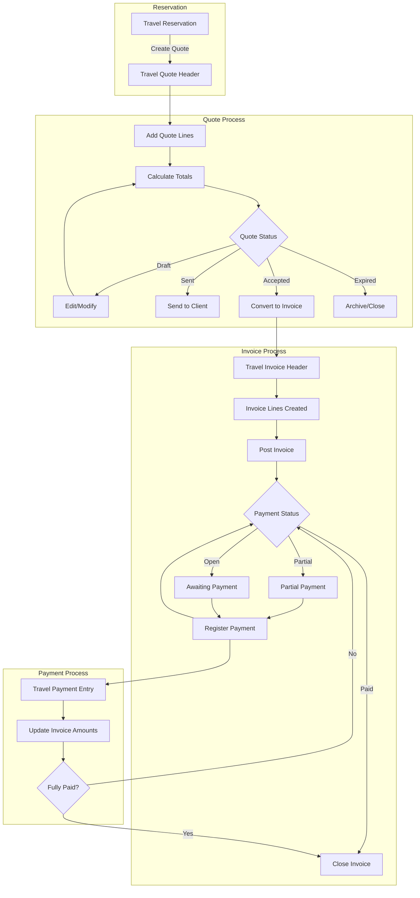
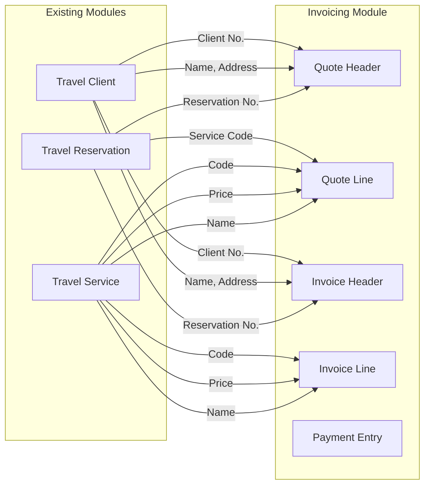

# Invoicing Module Architecture Design

## Overview

This document outlines the architecture design for the Invoicing/Billing module of the Travel Agency ERP system. The module integrates with existing components (TravelClient, TravelService, TravelReservation) to provide complete quote-to-cash functionality.

---

## 1. Data Model Design

### 1.1 Table Summary

| Table Name | Object ID | Description |
|------------|-----------|-------------|
| Travel Quote Header | 50630 | Main quote document header |
| Travel Quote Line | 50631 | Individual line items on a quote |
| Travel Invoice Header | 50632 | Main invoice document header |
| Travel Invoice Line | 50633 | Individual line items on an invoice |
| Travel Payment Entry | 50634 | Payment tracking records |

### 1.2 Travel Quote Header (Table 50630)

```
Table 50630 "Travel Quote Header"
```

| Field No. | Field Name | Data Type | Length | Description |
|-----------|------------|-----------|--------|-------------|
| 1 | No. | Code | 20 | Unique quote identifier |
| 2 | Client No. | Code | 20 | FK to Travel Client |
| 3 | Reservation No. | Code | 20 | FK to Travel Reservation (optional) |
| 4 | Document Date | Date | - | Quote creation date |
| 5 | Valid Until Date | Date | - | Quote expiration date |
| 6 | Status | Option | - | Draft, Sent, Accepted, Converted, Expired |
| 7 | Currency Code | Code | 10 | FK to Currency |
| 8 | Total Amount | Decimal | - | Sum of line amounts |
| 9 | Total VAT | Decimal | - | Total tax amount |
| 10 | Total Incl. VAT | Decimal | - | Grand total including tax |
| 11 | VAT Percentage | Decimal | - | Default VAT rate (e.g., 19%) |
| 12 | Payment Terms Code | Code | 10 | FK to Payment Terms |
| 13 | Bill-to Name | Text | 100 | Client name (denormalized) |
| 14 | Bill-to Address | Text | 100 | Client address |
| 15 | Bill-to City | Text | 50 | Client city |
| 16 | Bill-to Country | Code | 10 | Country code |
| 17 | Contact Email | Text | 80 | Contact email for quote delivery |
| 18 | Contact Phone | Text | 30 | Contact phone number |
| 19 | Notes | Text | 2048 | Internal notes |
| 20 | Created By | Code | 50 | User who created the quote |
| 50 | Client Name | FlowField | - | Lookup from Travel Client |

**Keys:**
- PK: No.
- Key: Client No.
- Key: Document Date

### 1.3 Travel Quote Line (Table 50631)

```
Table 50631 "Travel Quote Line"
```

| Field No. | Field Name | Data Type | Length | Description |
|-----------|------------|-----------|--------|-------------|
| 1 | Document No. | Code | 20 | FK to Travel Quote Header |
| 2 | Line No. | Integer | - | Unique line identifier |
| 3 | Service Code | Code | 20 | FK to Travel Service |
| 4 | Description | Text | 100 | Service description |
| 5 | Service Type | Option | - | Hotel, Flight, Tour, Car Rental, Activity |
| 6 | Quantity | Decimal | - | Number of units |
| 7 | Unit Price | Decimal | - | Price per unit |
| 8 | Line Discount % | Decimal | - | Discount percentage |
| 9 | Line Discount Amount | Decimal | - | Calculated discount amount |
| 10 | VAT % | Decimal | - | VAT rate for this line |
| 11 | VAT Amount | Decimal | - | Calculated VAT amount |
| 12 | Line Amount | Decimal | - | Quantity × Unit Price |
| 13 | Line Amount Incl. VAT | Decimal | - | Line total including VAT |
| 14 | Start Date | Date | - | Service start date |
| 15 | End Date | Date | - | Service end date |
| 16 | Location | Text | 50 | Service location |
| 50 | Service Name | FlowField | - | Lookup from Travel Service |

**Keys:**
- PK: Document No., Line No.

### 1.4 Travel Invoice Header (Table 50632)

```
Table 50632 "Travel Invoice Header"
```

| Field No. | Field Name | Data Type | Length | Description |
|-----------|------------|-----------|--------|-------------|
| 1 | No. | Code | 20 | Unique invoice identifier |
| 2 | Client No. | Code | 20 | FK to Travel Client |
| 3 | Reservation No. | Code | 20 | FK to Travel Reservation (optional) |
| 4 | Quote No. | Code | 20 | FK to Travel Quote Header (if converted) |
| 5 | Document Date | Date | - | Invoice date |
| 6 | Due Date | Date | - | Payment due date |
| 7 | Status | Option | - | Open, Paid, Partially Paid, Cancelled |
| 8 | Currency Code | Code | 10 | FK to Currency |
| 9 | Total Amount | Decimal | - | Sum of line amounts |
| 10 | Total VAT | Decimal | - | Total tax amount |
| 11 | Total Incl. VAT | Decimal | - | Grand total including tax |
| 12 | Amount Paid | Decimal | - | Total payments received |
| 13 | Remaining Amount | Decimal | - | Total Incl. VAT - Amount Paid |
| 14 | VAT Percentage | Decimal | - | Default VAT rate |
| 15 | Payment Terms Code | Code | 10 | FK to Payment Terms |
| 16 | Bill-to Name | Text | 100 | Client name |
| 17 | Bill-to Address | Text | 100 | Client address |
| 18 | Bill-to City | Text | 50 | Client city |
| 19 | Bill-to Country | Code | 10 | Country code |
| 20 | Contact Email | Text | 80 | Contact email |
| 21 | Contact Phone | Text | 30 | Contact phone |
| 22 | External Document No. | Code | 35 | Reference number from client |
| 23 | Notes | Text | 2048 | Internal notes |
| 24 | Created By | Code | 50 | User who created the invoice |
| 25 | Posted DateTime | DateTime | - | When invoice was posted |
| 50 | Client Name | FlowField | - | Lookup from Travel Client |

**Keys:**
- PK: No.
- Key: Client No.
- Key: Document Date
- Key: Quote No.

### 1.5 Travel Invoice Line (Table 50633)

```
Table 50633 "Travel Invoice Line"
```

| Field No. | Field Name | Data Type | Length | Description |
|-----------|------------|-----------|--------|-------------|
| 1 | Document No. | Code | 20 | FK to Travel Invoice Header |
| 2 | Line No. | Integer | - | Unique line identifier |
| 3 | Service Code | Code | 20 | FK to Travel Service |
| 4 | Description | Text | 100 | Service description |
| 5 | Service Type | Option | - | Hotel, Flight, Tour, Car Rental, Activity |
| 6 | Quantity | Decimal | - | Number of units |
| 7 | Unit Price | Decimal | - | Price per unit |
| 8 | Line Discount % | Decimal | - | Discount percentage |
| 9 | Line Discount Amount | Decimal | - | Calculated discount amount |
| 10 | VAT % | Decimal | - | VAT rate for this line |
| 11 | VAT Amount | Decimal | - | Calculated VAT amount |
| 12 | Line Amount | Decimal | - | Quantity × Unit Price |
| 13 | Line Amount Incl. VAT | Decimal | - | Line total including VAT |
| 14 | Start Date | Date | - | Service start date |
| 15 | End Date | Date | - | Service end date |
| 16 | Location | Text | 50 | Service location |
| 50 | Service Name | FlowField | - | Lookup from Travel Service |

**Keys:**
- PK: Document No., Line No.

### 1.6 Travel Payment Entry (Table 50634)

```
Table 50634 "Travel Payment Entry"
```

| Field No. | Field Name | Data Type | Length | Description |
|-----------|------------|-----------|--------|-------------|
| 1 | Entry No. | Integer | - | Auto-increment primary key |
| 2 | Invoice No. | Code | 20 | FK to Travel Invoice Header |
| 3 | Payment Date | Date | - | Date of payment |
| 4 | Amount | Decimal | - | Payment amount |
| 5 | Currency Code | Code | 10 | Payment currency |
| 6 | Payment Method | Option | - | Cash, Bank Transfer, Credit Card, Check |
| 7 | Reference No. | Code | 50 | Bank reference or check number |
| 8 | Bank Account No. | Code | 20 | Bank account receiving payment |
| 9 | Notes | Text | 250 | Payment notes |
| 10 | Created By | Code | 50 | User who recorded payment |
| 11 | Created DateTime | DateTime | - | When payment was recorded |

**Keys:**
- PK: Entry No.
- Key: Invoice No.
- Key: Payment Date

---

## 2. Page Design

### 2.1 Page Summary

| Page Name | Object ID | Page Type | Source Table |
|-----------|-----------|-----------|--------------|
| Travel Quote List | 50640 | List | Travel Quote Header |
| Travel Quote Card | 50641 | Document | Travel Quote Header |
| Travel Quote Subform | 50642 | ListPart | Travel Quote Line |
| Travel Invoice List | 50643 | List | Travel Invoice Header |
| Travel Invoice Card | 50644 | Document | Travel Invoice Header |
| Travel Invoice Subform | 50645 | ListPart | Travel Invoice Line |
| Travel Payment List | 50646 | List | Travel Payment Entry |
| Travel Payment Card | 50647 | Card | Travel Payment Entry |

### 2.2 Travel Quote Card Page Layout

```
┌─────────────────────────────────────────────────────────────────────────────┐
│  Travel Quote Card - QT-00001                                    [Actions] │
├─────────────────────────────────────────────────────────────────────────────┤
│  ┌─ General ──────────────────────────────────────────────────────────────┐ │
│  │ No.:              QT-00001          Status:        Draft               │ │
│  │ Client No.:       [Lookup]          Client Name:   John Doe            │ │
│  │ Reservation No.:  [Lookup]          Document Date: [Date Picker]        │ │
│  │ Valid Until:      [Date Picker]     Currency:      TND                 │ │
│  │ Payment Terms:    [Lookup]          VAT %:         19.00               │ │
│  └─────────────────────────────────────────────────────────────────────────┘ │
│  ┌─ Billing Information ───────────────────────────────────────────────────┐ │
│  │ Bill-to Name:     John Doe          Bill-to Address: 123 Main St       │ │
│  │ Bill-to City:     Tunis             Bill-to Country: TN                │ │
│  │ Contact Email:    john@email.com    Contact Phone:  +216 12 345 678    │ │
│  └─────────────────────────────────────────────────────────────────────────┘ │
│  ┌─ Lines ─────────────────────────────────────────────────────────────────┐ │
│  │ Line│Service│Description    │Type   │Qty│Unit Price│Disc%│Line Amount │ │
│  │ ────┼───────┼───────────────┼───────┼───┼──────────┼─────┼──────────── │ │
│  │ 1000│HOT001 │Hilton Tunis   │Hotel  │ 2 │  250.00  │  0  │   500.00   │ │
│  │ 2000│FLT001 │Tunis-Paris    │Flight │ 1 │  450.00  │ 10  │   405.00   │ │
│  │ 3000│TOU001 │City Tour      │Tour   │ 2 │   75.00  │  0  │   150.00   │ │
│  └─────────────────────────────────────────────────────────────────────────┘ │
│  ┌─ Totals ────────────────────────────────────────────────────────────────┐ │
│  │ Total Amount:     1,055.00 TND                                          │ │
│  │ Total VAT (19%):    200.45 TND                                          │ │
│  │ Total Incl. VAT:  1,255.45 TND                                          │ │
│  └─────────────────────────────────────────────────────────────────────────┘ │
│  ┌─ Notes ─────────────────────────────────────────────────────────────────┐ │
│  │ [Multi-line text area for internal notes]                               │ │
│  └─────────────────────────────────────────────────────────────────────────┘ │
├─────────────────────────────────────────────────────────────────────────────┤
│  Actions: [Create Invoice] [Send by Email] [Print PDF] [Copy Quote]         │
└─────────────────────────────────────────────────────────────────────────────┘
```

### 2.3 Travel Invoice Card Page Layout

```
┌─────────────────────────────────────────────────────────────────────────────┐
│  Travel Invoice Card - INV-00001                                 [Actions] │
├─────────────────────────────────────────────────────────────────────────────┤
│  ┌─ General ──────────────────────────────────────────────────────────────┐ │
│  │ No.:              INV-00001         Status:        Open                │ │
│  │ Client No.:       [Lookup]          Client Name:   John Doe            │ │
│  │ Reservation No.:  [Lookup]          Quote No.:     QT-00001            │ │
│  │ Document Date:    [Date Picker]     Due Date:      [Date Picker]        │ │
│  │ Currency:         TND               VAT %:         19.00               │ │
│  │ Payment Terms:    Net 30 Days       Ext. Doc No.:  [Client Ref]        │ │
│  └─────────────────────────────────────────────────────────────────────────┘ │
│  ┌─ Billing Information ───────────────────────────────────────────────────┐ │
│  │ Bill-to Name:     John Doe          Bill-to Address: 123 Main St       │ │
│  │ Bill-to City:     Tunis             Bill-to Country: TN                │ │
│  │ Contact Email:    john@email.com    Contact Phone:  +216 12 345 678    │ │
│  └─────────────────────────────────────────────────────────────────────────┘ │
│  ┌─ Lines ─────────────────────────────────────────────────────────────────┐ │
│  │ Line│Service│Description    │Type   │Qty│Unit Price│Disc%│Line Amount │ │
│  │ ────┼───────┼───────────────┼───────┼───┼──────────┼─────┼──────────── │ │
│  │ 1000│HOT001 │Hilton Tunis   │Hotel  │ 2 │  250.00  │  0  │   500.00   │ │
│  │ 2000│FLT001 │Tunis-Paris    │Flight │ 1 │  450.00  │ 10  │   405.00   │ │
│  │ 3000│TOU001 │City Tour      │Tour   │ 2 │   75.00  │  0  │   150.00   │ │
│  └─────────────────────────────────────────────────────────────────────────┘ │
│  ┌─ Totals ────────────────────────────────────────────────────────────────┐ │
│  │ Total Amount:     1,055.00 TND    Amount Paid:      500.00 TND         │ │
│  │ Total VAT (19%):    200.45 TND    Remaining:        755.45 TND         │ │
│  │ Total Incl. VAT:  1,255.45 TND                                         │ │
│  └─────────────────────────────────────────────────────────────────────────┘ │
│  ┌─ Payments ──────────────────────────────────────────────────────────────┐ │
│  │ Date       │Amount    │Method        │Reference                        │ │
│  │ 2026-02-15 │ 500.00   │Bank Transfer │TRX-12345                        │ │
│  │ [Register Payment]                                                        │ │
│  └─────────────────────────────────────────────────────────────────────────┘ │
├─────────────────────────────────────────────────────────────────────────────┤
│  Actions: [Register Payment] [Send by Email] [Print PDF] [Create Credit]    │
└─────────────────────────────────────────────────────────────────────────────┘
```

### 2.4 Travel Quote List Page

```
┌─────────────────────────────────────────────────────────────────────────────┐
│  Travel Quotes                                                   [+ New]   │
├─────────────────────────────────────────────────────────────────────────────┤
│  No.      │Client Name  │Date       │Valid Until│Total     │Status        │
│ ──────────┼─────────────┼───────────┼───────────┼──────────┼────────────── │
│  QT-00001 │John Doe     │2026-02-21 │2026-03-21 │1,255.45  │Draft         │
│  QT-00002 │Jane Smith   │2026-02-20 │2026-03-20 │2,100.00  │Sent          │
│  QT-00003 │Bob Wilson   │2026-02-19 │2026-03-19 │  850.00  │Accepted      │
│  QT-00004 │Alice Brown  │2026-02-18 │2026-02-25 │1,500.00  │Expired       │
│  QT-00005 │Charlie Kim  │2026-02-17 │2026-03-17 │3,200.00  │Converted     │
└─────────────────────────────────────────────────────────────────────────────┘
```

### 2.5 Travel Invoice List Page

```
┌─────────────────────────────────────────────────────────────────────────────┐
│  Travel Invoices                                                 [+ New]   │
├─────────────────────────────────────────────────────────────────────────────┤
│  No.      │Client Name  │Date       │Due Date  │Total    │Paid    │Status │
│ ──────────┼─────────────┼───────────┼──────────┼─────────┼────────┼─────── │
│  INV-00001│John Doe     │2026-02-21 │2026-03-23│1,255.45 │ 500.00 │Partial│
│  INV-00002│Jane Smith   │2026-02-20 │2026-03-22│2,100.00 │   0.00 │Open   │
│  INV-00003│Bob Wilson   │2026-02-19 │2026-03-21│  850.00 │ 850.00 │Paid   │
│  INV-00004│Alice Brown  │2026-02-18 │2026-03-20│1,500.00 │   0.00 │Open   │
│  INV-00005│Charlie Kim  │2026-02-17 │2026-03-19│3,200.00 │3,200.00│Paid   │
└─────────────────────────────────────────────────────────────────────────────┘
```

---

## 3. Process Flow

### 3.1 Quote-to-Invoice-to-Payment Flow Diagram



### 3.2 Detailed Process Steps

#### Step 1: Create Quote from Reservation
1. User selects a confirmed reservation from Travel Reservation List
2. System creates new Travel Quote Header with:
   - Client info from reservation
   - Reservation reference
   - Default payment terms
   - Default VAT rate
3. System creates Quote Lines from:
   - Services linked to the reservation
   - Prices from Travel Service table
   - Quantities based on reservation details

#### Step 2: Quote Management
1. User can modify line items, quantities, discounts
2. System recalculates totals automatically
3. User sets validity date
4. User can change status to Sent after review
5. System generates PDF for email/print

#### Step 3: Convert Quote to Invoice
1. User selects accepted quote
2. System creates Invoice Header from Quote Header
3. System copies Quote Lines to Invoice Lines
4. System sets Invoice Due Date based on Payment Terms
5. System marks Quote as Converted
6. Invoice status is set to Open

#### Step 4: Payment Registration
1. User opens Invoice and clicks Register Payment
2. User enters payment details:
   - Amount
   - Payment method
   - Reference number
   - Date
3. System creates Payment Entry
4. System updates Invoice Amount Paid and Remaining Amount
5. System updates Invoice Status:
   - Partial if Amount Paid < Total
   - Paid if Amount Paid = Total

---

## 4. Integration Points

### 4.1 Integration with Existing Modules



### 4.2 Table Relations Summary

| From Table | From Field | To Table | To Field | Relation Type |
|------------|------------|----------|----------|---------------|
| Travel Quote Header | Client No. | Travel Client | No. | Many-to-One |
| Travel Quote Header | Reservation No. | Travel Reservation | Reservation No. | Many-to-One |
| Travel Quote Line | Document No. | Travel Quote Header | No. | Many-to-One |
| Travel Quote Line | Service Code | Travel Service | Code | Many-to-One |
| Travel Invoice Header | Client No. | Travel Client | No. | Many-to-One |
| Travel Invoice Header | Reservation No. | Travel Reservation | Reservation No. | Many-to-One |
| Travel Invoice Header | Quote No. | Travel Quote Header | No. | Many-to-One |
| Travel Invoice Line | Document No. | Travel Invoice Header | No. | Many-to-One |
| Travel Invoice Line | Service Code | Travel Service | Code | Many-to-One |
| Travel Payment Entry | Invoice No. | Travel Invoice Header | No. | Many-to-One |

### 4.3 Codeunit Integration

| Codeunit Name | Object ID | Purpose |
|---------------|-----------|---------|
| Quote Management | 50650 | Create, modify, convert quotes |
| Invoice Management | 50651 | Create invoices, post, calculate totals |
| Payment Management | 50652 | Register payments, update status |
| Document PDF Generator | 50653 | Generate PDF for quotes and invoices |
| Number Series Management | 50654 | Handle document numbering |

### 4.4 Event Integration Points

```al
// Events for extension by other modules
event OnBeforeQuoteCreated(var TravelQuoteHeader: Record "Travel Quote Header")
event OnAfterQuoteCreated(var TravelQuoteHeader: Record "Travel Quote Header")
event OnBeforeQuoteToInvoice(var TravelQuoteHeader: Record "Travel Quote Header"; var TravelInvoiceHeader: Record "Travel Invoice Header")
event OnAfterQuoteToInvoice(var TravelQuoteHeader: Record "Travel Quote Header"; var TravelInvoiceHeader: Record "Travel Invoice Header")
event OnBeforePaymentRegistered(var TravelPaymentEntry: Record "Travel Payment Entry")
event OnAfterPaymentRegistered(var TravelPaymentEntry: Record "Travel Payment Entry"; var TravelInvoiceHeader: Record "Travel Invoice Header")
event OnInvoiceFullyPaid(var TravelInvoiceHeader: Record "Travel Invoice Header")
```

---

## 5. PDF Generation Approach

### 5.1 Business Central Report-Based PDF Generation

Business Central uses **RDLC Report Layouts** or **Word Report Layouts** for PDF generation. The recommended approach:

#### Option A: RDLC Report Layout (Recommended)

**Advantages:**
- Native to Business Central
- Full control over layout and formatting
- Supports complex calculations and grouping
- Can include images, barcodes, QR codes
- Better for multi-page documents

**Implementation:**

1. **Create Report Objects:**
   - Report 50660: Quote PDF Report
   - Report 50661: Invoice PDF Report

2. **Report Structure:**
```al
report 50660 "Travel Quote PDF"
{
    DefaultLayout = RDLCLayout;
    RDLCLayout = './layouts/TravelQuotePDF.rdlc';
    
    dataset
    {
        dataitem(Header; "Travel Quote Header")
        {
            column(QuoteNo; "No.") { }
            column(ClientName; "Bill-to Name") { }
            column(DocumentDate; "Document Date") { }
            column(ValidUntil; "Valid Until Date") { }
            column(TotalAmount; "Total Amount") { }
            column(TotalVAT; "Total VAT") { }
            column(TotalInclVAT; "Total Incl. VAT") { }
            column(CurrencyCode; "Currency Code") { }
            
            dataitem(Line; "Travel Quote Line")
            {
                DataItemLink = "Document No." = field("No.");
                column(LineNo; "Line No.") { }
                column(Description; Description) { }
                column(ServiceType; "Service Type") { }
                column(Quantity; Quantity) { }
                column(UnitPrice; "Unit Price") { }
                column(LineDiscount; "Line Discount %") { }
                column(LineAmount; "Line Amount") { }
            }
        }
    }
}
```

3. **RDLC Layout Features:**
   - Company logo in header
   - Client information block
   - Line items table with alternating row colors
   - Totals section with VAT breakdown
   - Terms and conditions footer
   - Page numbers

#### Option B: Word Report Layout

**Advantages:**
- Easier to design for non-technical users
- Can be edited in Microsoft Word
- Good for simple layouts

**Implementation:**
```al
report 50660 "Travel Quote PDF"
{
    DefaultLayout = WordLayout;
    WordLayout = './layouts/TravelQuotePDF.docx';
    // ... dataset definition
}
```

### 5.2 PDF Generation Codeunit

```al
codeunit 50653 "Document PDF Generator"
{
    procedure GenerateQuotePDF(QuoteNo: Code[20]): Text
    var
        TravelQuoteHeader: Record "Travel Quote Header";
        QuoteReport: Report "Travel Quote PDF";
        TempBlob: Codeunit "Temp Blob";
        OutStr: OutStream;
        InStr: InStream;
        PDFBase64: Text;
    begin
        TravelQuoteHeader.Get(QuoteNo);
        QuoteReport.SetTableView(TravelQuoteHeader);
        
        // Save to TempBlob
        TempBlob.CreateOutStream(OutStr);
        QuoteReport.SaveAs('', ReportFormat::Pdf, OutStr);
        
        // Convert to Base64 for API response
        TempBlob.CreateInStream(InStr);
        PDFBase64 := ConvertToBase64(InStr);
        
        exit(PDFBase64);
    end;
    
    procedure GenerateInvoicePDF(InvoiceNo: Code[20]): Text
    var
        TravelInvoiceHeader: Record "Travel Invoice Header";
        InvoiceReport: Report "Travel Invoice PDF";
        TempBlob: Codeunit "Temp Blob";
        OutStr: OutStream;
        InStr: InStream;
        PDFBase64: Text;
    begin
        TravelInvoiceHeader.Get(InvoiceNo);
        InvoiceReport.SetTableView(TravelInvoiceHeader);
        
        TempBlob.CreateOutStream(OutStr);
        InvoiceReport.SaveAs('', ReportFormat::Pdf, OutStr);
        
        TempBlob.CreateInStream(InStr);
        PDFBase64 := ConvertToBase64(InStr);
        
        exit(PDFBase64);
    end;
    
    procedure EmailQuotePDF(QuoteNo: Code[20]; EmailAddress: Text)
    var
        Email: Codeunit Email;
        EmailMessage: Codeunit "Email Message";
        TravelQuoteHeader: Record "Travel Quote Header";
        TempBlob: Codeunit "Temp Blob";
        OutStr: OutStream;
        FileName: Text;
    begin
        TravelQuoteHeader.Get(QuoteNo);
        
        // Create email
        EmailMessage.Create(
            EmailAddress,
            StrSubstNo('Quote %1 from Travel Agency', QuoteNo),
            'Please find attached your quote.'
        );
        
        // Generate PDF and attach
        TempBlob.CreateOutStream(OutStr);
        Report.SaveAs(Report::"Travel Quote PDF", '', ReportFormat::Pdf, OutStr, TravelQuoteHeader);
        
        FileName := StrSubstNo('Quote_%1.pdf', QuoteNo);
        EmailMessage.AddAttachment(FileName, 'application/pdf', TempBlob);
        
        // Send email
        Email.Send(EmailMessage);
    end;
}
```

### 5.3 PDF Layout Template Structure

```
┌─────────────────────────────────────────────────────────────────────────────┐
│  ┌─────────────────────────────────────────────────────────────────────┐   │
│  │ [COMPANY LOGO]                        TRAVEL AGENCY NAME            │   │
│  │                                       Address, City, Country        │   │
│  │                                       Phone | Email | Website       │   │
│  └─────────────────────────────────────────────────────────────────────┘   │
│                                                                             │
│  QUOTE / INVOICE                                                            │
│  ┌─────────────────────────────────────────────────────────────────────┐   │
│  │ Document No.: QT-00001              Date: 2026-02-21                │   │
│  │ Valid Until: 2026-03-21             Currency: TND                   │   │
│  └─────────────────────────────────────────────────────────────────────┘   │
│                                                                             │
│  BILL TO:                                                                   │
│  ┌─────────────────────────────────────────────────────────────────────┐   │
│  │ Client Name                                                          │   │
│  │ Address                                                              │   │
│  │ City, Country                                                        │   │
│  │ Email | Phone                                                        │   │
│  └─────────────────────────────────────────────────────────────────────┘   │
│                                                                             │
│  ┌─────────────────────────────────────────────────────────────────────┐   │
│  │ Service    │Description    │Qty│Unit Price│Disc%│Line Amount       │   │
│  ├────────────┼───────────────┼───┼──────────┼─────┼────────────────── │   │
│  │ Hotel      │Hilton Tunis   │ 2 │  250.00  │  0  │  500.00          │   │
│  │ Flight     │Tunis-Paris    │ 1 │  450.00  │ 10  │  405.00          │   │
│  │ Tour       │City Tour      │ 2 │   75.00  │  0  │  150.00          │   │
│  └─────────────────────────────────────────────────────────────────────┘   │
│                                                                             │
│                                              ┌──────────────────────────┐   │
│                                              │ Subtotal:      1,055.00  │   │
│                                              │ VAT (19%):       200.45  │   │
│                                              │ ──────────────────────── │   │
│                                              │ TOTAL:        1,255.45   │   │
│                                              └──────────────────────────┘   │
│                                                                             │
│  ┌─────────────────────────────────────────────────────────────────────┐   │
│  │ Terms & Conditions:                                                  │   │
│  │ • This quote is valid for 30 days                                   │   │
│  │ • Payment terms: Net 30 days                                        │   │
│  │ • Cancellation policy: ...                                          │   │
│  └─────────────────────────────────────────────────────────────────────┘   │
│                                                                             │
│  Page 1 of 1                                          Generated by ERP     │
└─────────────────────────────────────────────────────────────────────────────┘
```

---

## 6. Number Series Configuration

### 6.1 Number Series Setup

| Series Code | Description | Starting No. | Ending No. | Default |
|-------------|-------------|--------------|------------|---------|
| QUOTE | Quote Numbers | QT-00001 | QT-99999 | Yes |
| INVOICE | Invoice Numbers | INV-00001 | INV-99999 | Yes |
| PAYMENT | Payment Entry Numbers | PAY-00001 | PAY-99999 | Yes |

### 6.2 Number Series Implementation

```al
codeunit 50654 "Number Series Management"
{
    procedure GetNextQuoteNo(): Code[20]
    var
        NoSeries: Codeunit "No. Series";
    begin
        exit(NoSeries.GetNextNo('QUOTE', Today()));
    end;
    
    procedure GetNextInvoiceNo(): Code[20]
    var
        NoSeries: Codeunit "No. Series";
    begin
        exit(NoSeries.GetNextNo('INVOICE', Today()));
    end;
    
    procedure GetNextPaymentNo(): Code[20]
    var
        NoSeries: Codeunit "No. Series";
    begin
        exit(NoSeries.GetNextNo('PAYMENT', Today()));
    end;
}
```

---

## 7. Security and Permissions

### 7.1 Permission Sets

| Permission Set | Description | Tables Access |
|----------------|-------------|---------------|
| TRAVEL QUOTE VIEW | View quotes | Read: Quote Header, Quote Line |
| TRAVEL QUOTE EDIT | Create/edit quotes | Read/Insert/Modify/Delete: Quote Header, Quote Line |
| TRAVEL INVOICE VIEW | View invoices | Read: Invoice Header, Invoice Line, Payment Entry |
| TRAVEL INVOICE EDIT | Create/edit invoices | Read/Insert/Modify/Delete: Invoice Header, Invoice Line |
| TRAVEL PAYMENT EDIT | Register payments | Read/Insert: Payment Entry; Modify: Invoice Header (Amount fields) |
| TRAVEL ADMIN | Full access | Full access to all invoicing tables |

### 7.2 Data Classification

| Table | Data Classification |
|-------|---------------------|
| Travel Quote Header | CustomerContent |
| Travel Quote Line | CustomerContent |
| Travel Invoice Header | CustomerContent |
| Travel Invoice Line | CustomerContent |
| Travel Payment Entry | CustomerContent |

---

## 8. Implementation Phases

### Phase 1: Core Tables and Pages
- Create all table objects
- Create basic list and card pages
- Implement number series

### Phase 2: Business Logic
- Implement Quote Management codeunit
- Implement Invoice Management codeunit
- Implement Payment Management codeunit
- Add validation and calculation logic

### Phase 3: PDF Generation
- Create RDLC report layouts
- Implement PDF generation codeunit
- Add email functionality

### Phase 4: Integration
- Add actions to Travel Reservation List
- Implement Create Quote from Reservation
- Add FlowFields for invoice totals on Client

### Phase 5: Testing and Documentation
- Unit tests for calculations
- Integration tests for workflows
- User documentation

---

## 9. Object ID Allocation Summary

| Object Type | ID Range | Purpose |
|-------------|----------|---------|
| Tables | 50630-50639 | Invoicing data tables |
| Pages | 50640-50649 | Invoicing UI pages |
| Codeunits | 50650-50659 | Business logic |
| Reports | 50660-50669 | PDF generation |
| XML Ports | 50670-50679 | Data import/export (future) |
| Queries | 50680-50689 | Reporting queries (future) |

---

## 10. Appendix: Sample AL Code Structure

### 10.1 Table Example: Travel Quote Header

```al
table 50630 "Travel Quote Header"
{
    DataClassification = CustomerContent;
    Caption = 'Travel Quote Header';
    
    fields
    {
        field(1; "No."; Code[20])
        {
            Caption = 'No.';
            DataClassification = CustomerContent;
        }
        field(2; "Client No."; Code[20])
        {
            Caption = 'Client No.';
            DataClassification = CustomerContent;
            TableRelation = "Travel Client"."No.";
            
            trigger OnValidate()
            var
                TravelClient: Record "Travel Client";
            begin
                if "Client No." <> '' then begin
                    TravelClient.Get("Client No.");
                    "Bill-to Name" := TravelClient.Name;
                    // Copy other client details
                end;
            end;
        }
        field(3; "Reservation No."; Code[20])
        {
            Caption = 'Reservation No.';
            DataClassification = CustomerContent;
            TableRelation = "Travel Reservation"."Reservation No.";
        }
        field(4; "Document Date"; Date)
        {
            Caption = 'Document Date';
            DataClassification = CustomerContent;
        }
        field(5; "Valid Until Date"; Date)
        {
            Caption = 'Valid Until Date';
            DataClassification = CustomerContent;
        }
        field(6; Status; Option)
        {
            Caption = 'Status';
            OptionMembers = Draft,Sent,Accepted,Converted,Expired;
            DataClassification = CustomerContent;
        }
        // ... additional fields
    }
    
    keys
    {
        key(PK; "No.")
        {
            Clustered = true;
        }
        key(ClientNo; "Client No.") { }
        key(DocumentDate; "Document Date") { }
    }
    
    trigger OnInsert()
    var
        NoSeriesMgt: Codeunit "No. Series";
    begin
        if "No." = '' then
            "No." := NoSeriesMgt.GetNextNo('QUOTE', Today(), true);
        "Document Date" := Today();
        "Created By" := UserId;
    end;
}
```

---

*Document Version: 1.0*
*Created: 2026-02-21*
*Author: Architecture Team*
